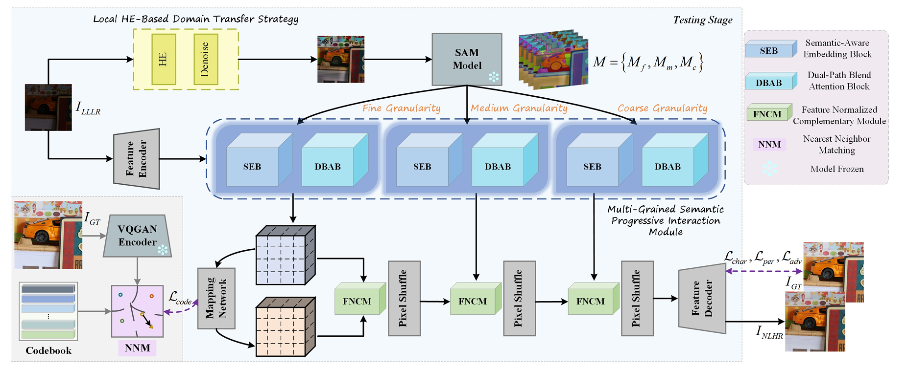

# MSIRNet

This is the official PyTorch codes for the paper  
[Learning multi-granularity semantic interactive representation for joint low-light image enhancement and super-resolution](https://www.sciencedirect.com/science/article/pii/S1566253524002458)  



## Dependencies and Installation

```
# create new anaconda env
conda create -n msir python=3.7.11
conda activate msir 

# install python dependencies
pip3 install -r requirements.txt
python setup.py develop
```


## Dataset

- Download the [dataset](https://pan.baidu.com/s/1d7bO9lZrbpbxoX-Zl7ub2w?pwd=lyc9).
- Specify their path in the corresponding option file or extract it to the project root directory.

## Quick Inference
- Download our [model](https://github.com/liushh39/MSIRNet/releases/download/v1.0.0/net_g_111250.pth)
- Put the pretrained models in `experiments/`

```
python inference_MSIRNet.py
```

## Train the model

### Model preparation

Before training, you need to
- Download the pretrained HRP model: [generator](https://github.com/liushh39/MSIRNet/releases/download/v1.0.0/FeMaSR_HRP_model_g.pth), [discriminator](https://github.com/liushh39/MSIRNet/releases/download/v1.0.0/FeMaSR_HRP_model_d.pth) 
- Put the pretrained models in `experiments/pretrained_models`
- Specify their path in the corresponding option file.

### Train SR model

```
python basicsr/train.py -opt options/train_MSIR_LQ_stage_LOLX4.yml
```

## Citation
```
@article{YE2024102467,
title = {Learning multi-granularity semantic interactive representation for joint low-light image enhancement and super-resolution},
journal = {Information Fusion},
pages = {102467},
year = {2024},
issn = {1566-2535},
doi = {https://doi.org/10.1016/j.inffus.2024.102467},
url = {https://www.sciencedirect.com/science/article/pii/S1566253524002458},
author = {Jing Ye and Shenghao Liu and Changzhen Qiu and Zhiyong Zhang},
}
```

## Acknowledgement

The code is based on [FeMaSR](https://github.com/chaofengc/FeMaSR) and [BasicSR](https://github.com/xinntao/BasicSR).
